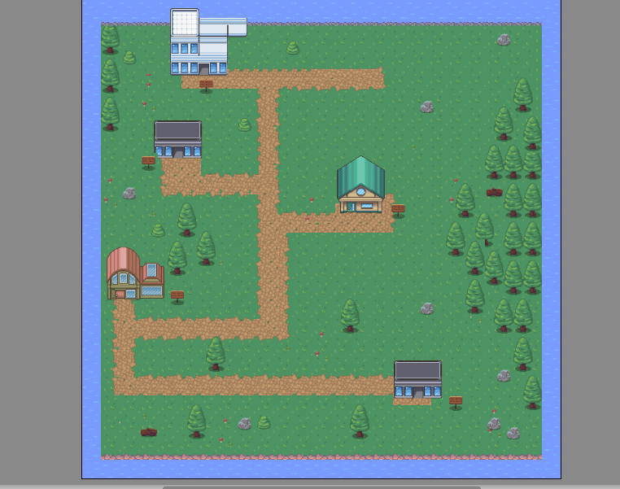
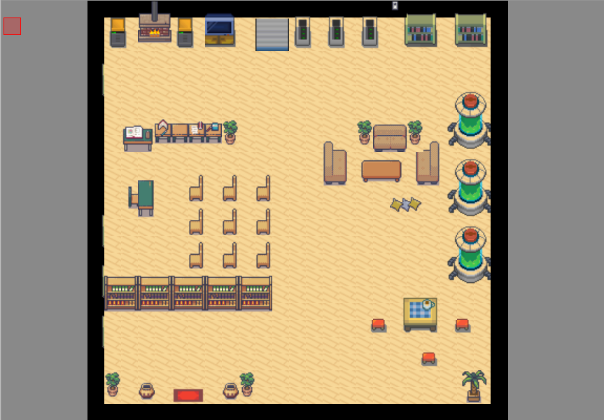
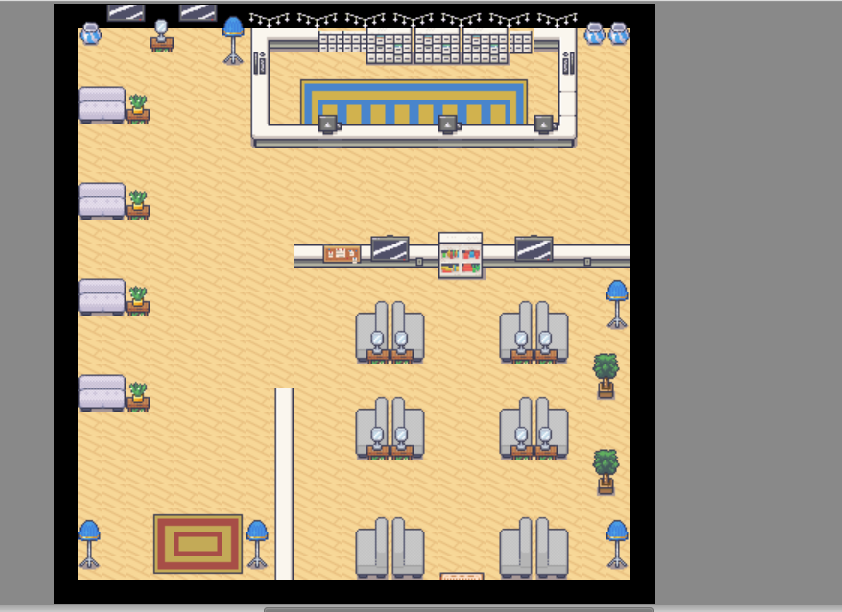

# python-2d-game

This is a simple 2D  RPG game that lets you control a character (me) and visit house to find my CV :)
Made in python3 with pygame 

- 🌱Still in development

All the sheets are from https://opengameart.org/
I only use them for the game, I earn no credits with that.

### Screenshots:

My game is not finished yet, but you can see the screenshots here:

World in  progress:

The hero:

House1:

House2:

## Installation

This project uses Python3. 
 
The library [Pygame](https://www.pygame.org) is also used. 

## Playing the game

Simply run:
    Main.py

## Gameplay basics

* Use arrow keys to move
* IN PROGRESS -----Use spacebar to interact with NPCs and other entities in the environment----Library to fix

__________________________
## Important !

If you are a dev I will love some help with the code, so please contact me !

- 📫 How to reach me: ...
   *    [mailto](mailto:elodiegage@gmail.com/ "reach me")
